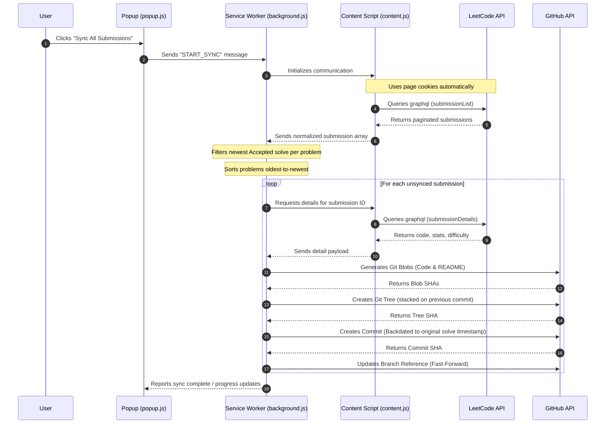

# 🚀 LeetSync
### Automatically sync your LeetCode submissions to GitHub with original solve dates

<p align="center">
  
</p>

<p align="center">
  <strong>The only Chrome extension that can sync your complete LeetCode history while preserving your original solve dates on GitHub.</strong>
</p>

<p align="center">
  
  
  
</p>

---

## 📸 Visuals & Screenshots

### Extension Settings & Live Synchronization


### Reconstructed GitHub Contribution Graph


---

## ❓ Why LeetSync?

Many existing solutions only upload future submissions or create commits using the current date. LeetSync reconstructs your entire solving history by:

*   **Fetching every accepted submission** from the very beginning.
*   **Keeping only the newest accepted solution** per problem to keep your repo neat.
*   **Creating Git commits using the original submission timestamp**, preserving your historical GitHub contribution graph (green squares).

---

## 📊 Feature Comparison

| Feature | LeetSync | Other Extensions |
| :--- | :---: | :---: |
| **Complete Historical Sync** | ✅ | ⚠️ Partial |
| **Original Solve-Date Commits** | ✅ | ❌ |
| **Auto-Sync** | ✅ | ✅ |
| **README Generation** | ✅ | Some |
| **Works without LC Credentials** | ✅ | Some require cookies |

---

## 🌟 Key Features

*   **📅 Original Solve-Date Commits (Green Contribution Squares):** Uses GitHub's low-level Git Data API to write commits with the **original LeetCode solve date**, ensuring your GitHub contribution graph accurately reflects when you actually solved the problems.
*   **🔄 Complete Historical Sync:** Pages through your entire historical submission log—not just your future submissions.
*   **⚡ Real-Time Auto-Sync:** Intercepts editor submit clicks (`Ctrl/Cmd + Enter` or clicking **Submit**) on `leetcode.com`, polls for the judge result, and automatically pushes your newly accepted solves in the background.
*   **🔒 Secure & Zero-Credential for LeetCode:** Runs within your browser session on the `leetcode.com` origin. Your cookies are attached automatically, meaning **no LeetCode username/password/cookie tokens need to be saved or configured inside the extension**.
*   **📂 Customizable Folder Structure:** Organize your repository using a dynamic path template (e.g., `solutions/{slug}`). Files created include:
    *   `{slug}.{ext}`: The solution file in the correct extension.
    *   `README.md`: A beautiful summary including Title, Difficulty, Problem Link, Runtime, Memory, and Solve Date.
*   **💾 Local Storage Cache:** Keeps a record of already synced submissions inside `chrome.storage.local` to prevent duplicate Git tree operations and stay within API rate limits.
*   **🚀 Optimized Sequential Batch Sync:** Chains commits sequentially in memory to completely avoid Git ref conflicts and maximize synchronization speed.

---

## 🛠️ Built With

*   **Chrome Extension Manifest V3** (service workers and secure origin scoping)
*   **JavaScript (ES2023)** (native web API implementations)
*   **GitHub Git Data REST API** (low-level tree, blob, commit, and reference manipulation)
*   **LeetCode GraphQL API** (official endpoints used by the LeetCode frontend)
*   **Chrome Storage API** (for local caching of sync states)
*   **Chrome Runtime Messaging** (for seamless IPC between components)

---

## 🔤 Supported Languages

LeetSync automatically detects the language and writes the file with the correct extension. Supported languages include:
*   C++ (`.cpp`)
*   Java (`.java`)
*   Python & Python3 (`.py`)
*   JavaScript (`.js`)
*   TypeScript (`.ts`)
*   Go (`.go`)
*   Rust (`.rs`)
*   Kotlin (`.kt`)
*   Swift (`.swift`)
*   C# (`.cs`)
*   PHP (`.php`)
*   Ruby (`.rb`)
*   Scala (`.scala`)
*   Dart (`.dart`)
*   SQL (MySQL, MS SQL, Oracle SQL) (`.sql`)
*   *and every other language supported by LeetCode.*

---

## 🛠️ How it Works Under the Hood



---

## 📂 Repository Structure Created

By default, the extension saves solutions under the `solutions/{problem-slug}/` directory:

```
leetcode-solutions-repo/
├── README.md               # Base repository README (auto-initialized if empty)
└── solutions/
    ├── two-sum/
    │   ├── two-sum.py      # Your code in the respective language
    │   └── README.md       # Problem metadata, stats, & LeetCode link
    └── add-two-numbers/
        ├── add-two-numbers.cpp
        └── README.md
```

### Problem README Format
Each solution folder contains a clean Markdown file with details:
```markdown
# Two Sum

- Difficulty: Easy
- LeetCode problem: https://leetcode.com/problems/two-sum/
- Language: python3
- Runtime: 32 ms
- Memory: 17.6 MB
- Solved: 2026-05-14
```

---

## 🚀 Installation & Setup

### 1. Load the Chrome Extension
1. Download or clone this directory to your local computer.
2. Open Google Chrome and navigate to `chrome://extensions`.
3. Enable **Developer mode** using the toggle in the top-right corner.
4. Click **Load unpacked** (top-left) and select this extension folder.

### 2. Prepare Your GitHub Repository
1. Create a repository on GitHub (e.g., `leetcode-solutions`). It can be private or public.
2. Generate a **GitHub Personal Access Token (PAT)**:
   * Go to **GitHub** → **Settings** → **Developer settings** → **Personal access tokens** → **Fine-grained tokens** (Recommended) or **Tokens (classic)**.
   * **Fine-grained Token settings:**
     * Repository access: Select **Only select repositories** → Choose your solutions repo.
     * Permissions: Grant **Contents: Read and write** permission.
   * **Classic Token settings:**
     * Scopes: Select the `repo` scope.

### 3. Configure the Extension Popup
1. Click the **LeetSync** puzzle icon in your Chrome toolbar.
2. Fill in the configuration details:
   * **Personal Access Token:** Paste your generated GitHub token.
   * **Owner:** Your GitHub username (or organization name).
   * **Repository:** The name of your solutions repository.
   * **Branch:** The default branch (usually `main`).
   * **Path Template:** The directory structure. `solutions/{slug}` represents `solutions/problem-name/`.
   * **Only sync Accepted:** (Enabled by default) Only copies submissions with the "Accepted" status.
3. The popup validates your username and repository status in real-time, displaying green checkmarks once valid credentials are provided.

---

## ⚡ Syncing Methods

### Method A: Bulk Historical Sync
1. Open a browser tab, navigate to `https://leetcode.com`, and ensure you are **logged in**.
2. Open the **LeetSync** extension popup.
3. Click **Sync All Submissions**.
4. You will see a live progress bar. You can safely close the popup; the synchronization process runs entirely in the background service worker. Reopening the popup will restore the active progress indicators.

### Method B: Real-Time Auto-Sync
Once setup is complete, you don't need to manually trigger synchronization.
1. Solve any problem on `leetcode.com`.
2. Click **Submit** or press `Ctrl + Enter` / `Cmd + Enter`.
3. The extension detects the submission, waits for LeetCode to finish judging, and automatically commits the solution to your GitHub repository in the background.

---

## ⚙️ Configuration Fields Explained

| Field | Default Value | Description |
| :--- | :--- | :--- |
| **Personal Access Token** | *Required* | Authentication credential for GitHub API. Needs write access to repository contents. |
| **Owner** | *Required* | Your GitHub username or organization name. |
| **Repository** | *Required* | The target repository name. |
| **Branch** | `main` | The target branch. Will be auto-bootstrapped if empty. |
| **Path Template** | `solutions/{slug}` | The directory path template where `{slug}` represents the LeetCode URL slug. |
| **Only sync Accepted** | `Checked` | When unchecked, LeetSync will copy your latest solution of any status (e.g., Wrong Answer, Time Limit Exceeded). |

---

## 📁 Extension File Hierarchy

*   [`manifest.json`](file:///home/shashank/Desktop/lc-github-sync-extension/lc-github-sync/manifest.json): Extension configuration, declarations, script mappings, and domain permissions.
*   [`popup.html`](file:///home/shashank/Desktop/lc-github-sync-extension/lc-github-sync/popup.html) / [`popup.css`](file:///home/shashank/Desktop/lc-github-sync-extension/lc-github-sync/popup.css): A glassmorphic dashboard UI with configuration fields, real-time input validators, and animated progress tracking.
*   [`popup.js`](file:///home/shashank/Desktop/lc-github-sync-extension/lc-github-sync/popup.js): Logic for saving settings, fetching live progress logs, and calling validator endpoints.
*   [`content.js`](file:///home/shashank/Desktop/lc-github-sync-extension/lc-github-sync/content.js): Content script executed in `leetcode.com` origin. Acts as an API bridge utilizing user session cookies, and intercepts submissions.
*   [`background.js`](file:///home/shashank/Desktop/lc-github-sync-extension/lc-github-sync/background.js): The central service worker. Coordinates paginated history extraction, builds sequential Git trees, backdates commit headers, and throttles API request loops.

---


## 💡 Troubleshooting & Notes

*   **Rate Limiting / Sleep Throttling:** LeetSync includes an intentional built-in throttle delay between commits (~0.4s) to ensure it stays well within GitHub API's abuse rate limits.
*   **Empty Repositories:** If you sync to a brand-new repository with no files/commits, LeetSync automatically initializes it with a default repository `README.md` first. (The lower-level Git Data API requires at least one commit to exist to reference a branch tip).
*   **Reset History:** If you change your repository path format or want to force LeetSync to re-upload all code solutions, click **Reset** in the extension popup. This clears your local sync history cache so the next bulk sync pushes all solutions again.
*   **Tab Origin Warning:** Because the extension utilizes browser cookie isolation, **a tab containing `leetcode.com` must remain open and logged in** during the sync process.
