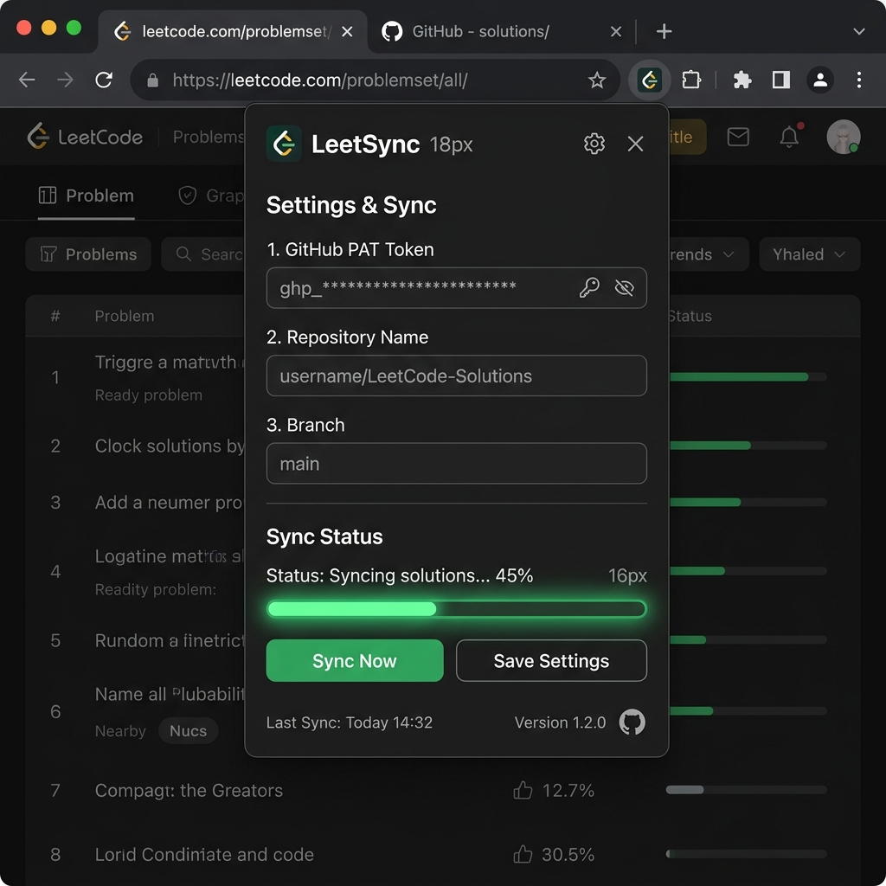
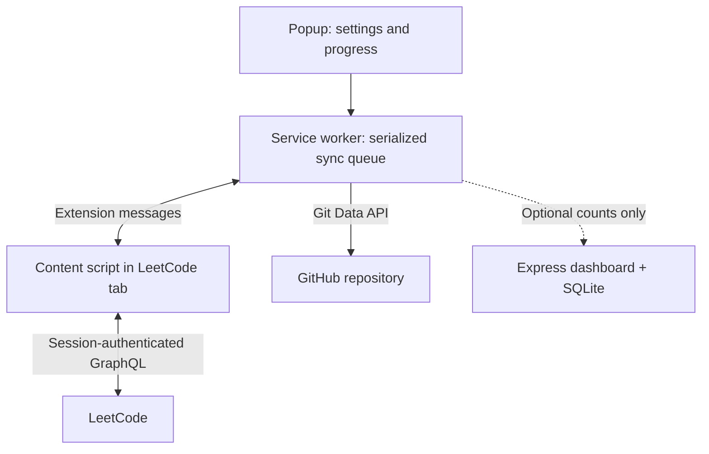

<p align="center"></p>
<h1 align="center">LeetSync</h1>
<p align="center"><strong>Your LeetCode solutions, organized in GitHub.</strong><br />A Chrome extension for historical imports and automatic submission sync.</p>
<p align="center">
  <a href="https://github.com/arpitkjaiswal/LeetSync/actions/workflows/checks.yml"></a>
  
  
</p>

[Quick start](#quick-start) · [Architecture](#architecture) · [Optional dashboard](#optional-dashboard) · [Deployment](#deployment) · [Troubleshooting](#troubleshooting)

## What it does

- Scans your LeetCode history and selects the **latest accepted submission per problem** by default.
- Writes a solution file and a problem README in one Git commit, using that submission's timestamp.
- Detects Submit clicks and Ctrl/Cmd+Enter, polls for a result, then queues automatic sync.
- Records completed submissions locally, scoped to repository, branch, folder template and acceptance setting.
- Uses **fast-forward-only** GitHub updates so a concurrent branch change cannot be overwritten.
- Optionally reports sync counts to your own Express + SQLite dashboard. Telemetry is **off by default**.

**The extension works without the dashboard.** A hosted dashboard does not install the extension or perform sync in the cloud. Your signed-in LeetCode browser session and a GitHub token are still required.

> Status: automated extension regression tests and backend HTTP tests are included. These mock GitHub/Chrome/LeetCode where needed; they do not prove a live authenticated LeetCode-to-GitHub sync. Follow the manual smoke check below before using a valuable destination repository.

## Preview

<p align="center"></p>

The screenshot predates the additional commit-email and optional telemetry settings.

## Quick start

### 1. Install locally in Chrome

```bash
git clone https://github.com/arpitkjaiswal/LeetSync.git
cd LeetSync
```

1. Open `chrome://extensions` and enable **Developer mode**.
2. Choose **Load unpacked** and select the repository root containing `manifest.json`.
3. Pin LeetSync, then open or refresh a tab at `https://leetcode.com` and sign in.

Use Chrome 110 or newer (prefer a current stable release). The extension has no build step and needs no npm packages. Node.js 22+ is needed only for tests or the optional server.

### 2. Prepare GitHub

Create a disposable solutions repository for the first test. Generate a **fine-grained personal access token** restricted to that repository with **Contents: Read and write**. Organization approval and branch rules may still apply.

Open the popup and set:

| Setting | Value / purpose |
| --- | --- |
| Personal access token | Your restricted GitHub token |
| Owner | Target GitHub user or organization |
| Repository | Repository name only, e.g. `leetcode-solutions` |
| Branch | `main`, or an intended target branch |
| Path template | `solutions/{slug}`; relative path, no `..` or `.git` segments |
| Only sync Accepted | Enabled unless you intentionally want latest non-accepted attempts too |
| Commit email (optional) | Exact verified or noreply address from GitHub Settings → Emails |

The commit author defaults to the **token owner**, not the repository organization. If the user's public email is unavailable, an ID-based GitHub noreply address is used. Set the exact email explicitly if attribution is wrong.

Click **Save**, then **Sync All Submissions**. Keep Chrome and a logged-in LeetCode tab open. Closing the popup is fine, but browser shutdown, tab logout or service-worker interruption can stop a job. Reopen the popup and retry; successful submissions remain cached.

### 3. Manual smoke check

1. Sync a small account/history into the disposable repository.
2. Confirm a `solutions/<slug>/<slug>.<ext>` file contains your actual solution and its README has the expected problem link and date.
3. Run bulk sync again: unchanged submissions should be skipped.
4. Submit a new accepted solution in LeetCode and verify one automatic commit.
5. With Accepted-only enabled, a failed submission must not create a commit.
6. Switch to another test repository: it should not reuse the first repository's cache.
7. Verify commit attribution on GitHub. Do not paste your token into logs, screenshots or issues.

## Architecture



`content.js` queries LeetCode using the browser session. `background.js` scans pages, keeps one eligible submission per problem, sorts selected submissions by time and uploads them sequentially. `popup.js` stores settings and reads progress from extension storage.

For each problem, the GitHub sequence is:

1. Resolve the target branch and its base tree.
2. Create two UTF-8 blobs: solution and README.
3. Create a tree based on the existing tree, preserving unrelated files.
4. Create a commit with that tree, its parent and the selected submission date.
5. Update the branch with `force: false`.
6. Cache success **only after** the branch update succeeds.

An empty repository is initialized with a README. A missing branch in a populated repository starts from its default branch. A conflicting branch update stops safely; resolve/retry instead of overwriting another commit.

### Example output

```text
solutions/
  two-sum/
    two-sum.py
    README.md
  add-two-numbers/
    add-two-numbers.cpp
    README.md
```

The extension maps common LeetCode language slugs (Python, C++, Java, JavaScript, TypeScript, Go, Rust, SQL and others) to extensions. Unknown slugs use `.txt`. It stores the **latest selected solution**, not every attempt or the first time you solved each problem. A later language switch may leave the earlier language's file in the folder.

## Optional dashboard

The dashboard shows reported sync actions, distinct target owners and summed problem counts. These are **client-reported telemetry**, not audited user or unique-problem counts. Resetting and syncing again can increase totals.

### Run on your computer

From the repository root:

```bash
cd backend
npm ci
```

Create `backend/.env` with local values:

```dotenv
NODE_ENV=development
HOST=127.0.0.1
PORT=3000
DB_PATH=./telemetry.db
ADMIN_USER=admin
ADMIN_PASSWORD=choose-a-long-random-password
TELEMETRY_KEY=choose-a-different-random-key
```

Run from `backend` (Node.js 22+):

```bash
node --env-file=.env server.js
```

Open `http://localhost:3000` and enter the admin credentials in the browser's login prompt. `http://localhost:3000/health` should return `{"status":"ok"}`. `npm start` is also available when your shell or host has already supplied the environment variables; it does not read `.env` automatically.

In the extension, expand **Commit identity & optional telemetry**, enable reporting, enter `http://localhost:3000` and the matching `TELEMETRY_KEY`, then click **Save**. Run a successful sync to populate the dashboard. Never use your GitHub PAT as this key.

### API contract

| Endpoint | Access | Purpose |
| --- | --- | --- |
| `GET /health` | Public | Database connectivity check |
| `POST /api/telemetry` | `X-Telemetry-Key` | Validated sync event; disabled without a key |
| `GET /api/stats` | Admin Basic auth | Aggregate reported counts |
| `GET /api/logs` | Admin Basic auth | Latest 200 events |
| `GET /` | Admin Basic auth | Dashboard |

Admin credentials are optional only in local development. Production refuses to start without `ADMIN_USER`, `ADMIN_PASSWORD`, `TELEMETRY_KEY` and `DB_PATH`. Put the production service behind HTTPS; Basic auth must not travel over public plaintext HTTP.

## Deployment

### Extension distribution

Load unpacked for your own machine, or package the extension for Chrome Web Store review. Hosting the files on a website does **not** install a Chrome extension. No store publication is included in this repository.

### Deploy the optional dashboard

Use a single persistent Node/container service (for example, Render or Railway) with HTTPS and an attached persistent disk. An ephemeral/serverless filesystem is unsuitable for this SQLite database.

| Host setting | Value |
| --- | --- |
| Repository | `arpitkjaiswal/LeetSync` |
| Root directory | `backend` |
| Runtime | Node.js 22+ |
| Build command | `npm ci --omit=dev` |
| Start command | `npm start` |
| Health check | `/health` |
| Disk mount | `/data` |
| `DB_PATH` | `/data/telemetry.db` |
| Other environment | `NODE_ENV=production`, `HOST=0.0.0.0`, admin credentials, telemetry key |
| Port | Use the host-provided `PORT` |

For Docker, from `backend`:

```bash
docker build -t leetsync-dashboard .
docker volume create leetsync-data
docker run --rm -p 3000:3000 \
  --env-file .env \
  -e NODE_ENV=production -e HOST=0.0.0.0 \
  -e DB_PATH=/data/telemetry.db \
  -v leetsync-data:/data leetsync-dashboard
```

Store credentials in the hosting provider's secret settings. Provisioning disks or compute may require a paid plan; check before creating resources. Keep one instance for SQLite, arrange database-aware backups, and add collector rate limits/retention before distributing telemetry to many users.

### After deployment

1. Visit `https://YOUR_HOST/health`, then log in to `/` with admin credentials.
2. Confirm `/api/logs` rejects unauthenticated requests.
3. In the popup, set the dashboard HTTPS origin and telemetry key; enable reporting and click **Save**. Chrome asks permission for that specific host.
4. Optionally set server `CORS_ORIGINS` to your `chrome-extension://<extension-id>` origin. The dashboard itself uses same-origin requests.
5. Sync one solution, verify the dashboard event, restart the service and verify it remains.
6. Test GitHub sync with the dashboard offline: the optional reporting service must not be needed for uploads.

**Deployment status:** no live dashboard URL is configured in this repository. Deployment requires a connected hosting account; a passing CI run is not a deployed service.

## Development and checks

```bash
# Repository root: no npm install needed
npm run check
npm test

# Optional server
cd backend
npm ci
npm test
```

GitHub Actions runs syntax checks, extension regression tests, real HTTP/SQLite backend tests and a production dependency audit. The reviewed branch passes 11 extension tests and 2 backend tests; its refreshed lockfile reports zero npm vulnerabilities as of 9 October 2026. Extension tests use mocked browser/API behavior, so browser installation, LeetCode endpoint compatibility and real GitHub write permissions still need the manual smoke check.

| File | Responsibility |
| --- | --- |
| [`manifest.json`](manifest.json) | Chrome permissions and script registration |
| [`background.js`](background.js) | Queue, Git operations, cache, optional telemetry |
| [`content.js`](content.js) | LeetCode session bridge and submission detection |
| [`popup.js`](popup.js), [`popup.html`](popup.html), [`popup.css`](popup.css) | Settings and progress UI |
| [`backend/server.js`](backend/server.js) | Authenticated dashboard and SQLite API |
| [`tests/`](tests/), [`backend/tests/`](backend/tests/) | Regression coverage |

## Troubleshooting

| Symptom | Check / action |
| --- | --- |
| Cannot connect to LeetCode | Sign in, refresh the LeetCode tab after extension installation/update, then retry |
| GitHub 401 / 403 | Token expiry, repository access, Contents write permission, organization approval or API limits |
| GitHub 409 / 422 | Target branch changed or branch rules reject the write; inspect the branch and retry |
| No contribution squares | Verify the exact commit email and GitHub's branch/repository eligibility; dates alone do not guarantee credit |
| Popup says interrupted | Retry bulk sync; successful writes have been cached |
| Wrong destination skipped | New destination caches are separate; older global caches are deliberately not reused |
| Dashboard stays empty | Reporting is opt-in; check URL, key, Chrome host permission and server logs |
| Server refuses production startup | Supply all required environment values and a writable persistent `DB_PATH` |

**Reset** clears local sync history, not GitHub commits or files. It can cause submissions to be uploaded again. Do not reset while a sync is running.

## Privacy and limitations

- GitHub PAT and settings live in `chrome.storage.local`, restricted to trusted extension contexts. This is not an encrypted vault; protect your browser profile and use least-privilege tokens.
- LeetCode session cookies stay in the browser; code is read through the signed-in tab and uploaded to your chosen GitHub repository.
- Optional telemetry sends target owner/repository, action, count, version and server receipt time. No solution code or GitHub token is sent to the dashboard.
- LeetCode's frontend GraphQL operations and DOM selectors can change. This is an independent project, not a LeetCode or GitHub product.
- Long jobs are not durably scheduled across browser shutdown. Retry skips confirmed cached writes, but a crash between branch update and cache write can create a duplicate commit on retry.
- Polling looks at the latest submission; rapid parallel submissions can be missed by auto-sync. Bulk sync reconciles the latest eligible result per problem.
- API throttling, branch protection, token policies and Chrome service-worker lifecycle still apply.
- No license file is currently supplied. Add an explicit license before presenting this as freely licensed software.

## References

- [Chrome service-worker lifecycle](https://developer.chrome.com/docs/extensions/develop/concepts/service-workers/lifecycle)
- [GitHub Git Database API](https://docs.github.com/en/rest/git)
- [GitHub contribution eligibility](https://docs.github.com/en/account-and-profile/reference/profile-contributions-reference)
- [Render persistent disks](https://render.com/docs/disks)
