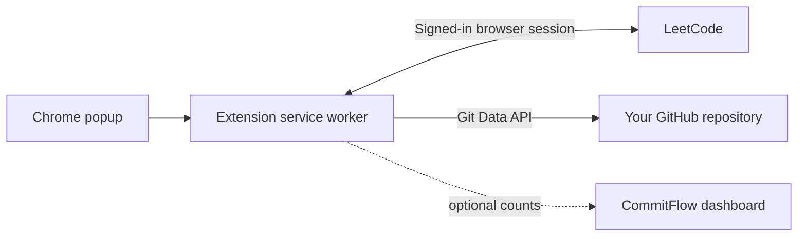

# CommitFlow

Keep your LeetCode solutions in GitHub, with a commit trail you can browse.

CommitFlow is a Chrome extension that imports your LeetCode submissions into a GitHub repository you choose. An optional dashboard shows sync activity you choose to share. The extension works without the dashboard.

[](https://github.com/arpitkjaiswal/CommitFlow/actions/workflows/checks.yml)  

## What it does

- **Import your history:** scans your LeetCode submissions and syncs the newest accepted solution for each problem by default.
- **Keep up as you solve:** watches for a LeetCode submission after you click **Submit** or use Ctrl/Cmd+Enter.
- **Write to your repository:** saves the solution and a small problem README under a folder layout you choose.
- **Preserve the submission date:** commits use the selected submission timestamp. GitHub contribution credit still depends on your commit email, repository, branch, and GitHub's eligibility rules.
- **Avoid overwriting branch changes:** pushes are fast-forward only. If the branch changes during a sync, CommitFlow stops and leaves the successful-sync cache untouched for that submission.
- **Share less by default:** optional telemetry is off until you enable it. It reports sync counts and repository identifiers, never solution code or your GitHub token.

## Install the extension

You need Chrome 110 or newer, a GitHub account, and a signed-in LeetCode tab.

```bash
git clone https://github.com/arpitkjaiswal/CommitFlow.git
cd CommitFlow
```

1. Open `chrome://extensions` and turn on **Developer mode**.
2. Select **Load unpacked** and choose the `CommitFlow` folder containing `manifest.json`.
3. Pin CommitFlow, open `https://leetcode.com`, and sign in.
4. In the extension popup, enter a GitHub fine-grained personal access token limited to your destination repository, with **Contents: Read and write** permission.
5. Enter the repository owner and name, choose a branch and path template, then select **Save**.
6. Start with a disposable repository and choose **Sync All Submissions** to confirm the result before using a repository you care about.

For a quick smoke check, verify that the solution and problem README appear in GitHub, then run **Sync All Submissions** again to confirm there are no duplicate writes. Submit one new accepted solution and check that it creates one commit. With **Only sync Accepted** on, a rejected submission should not be committed.

The popup settings are:

| Setting | What it controls |
| --- | --- |
| Owner / repository | Destination GitHub repository |
| Branch | Branch to update; defaults to `main` |
| Path template | Relative folder for each problem; defaults to `solutions/{slug}`. Dot segments and absolute paths are rejected. |
| Only sync Accepted | When on, choose the newest accepted submission per problem. When off, choose the newest submission regardless of result. |
| Commit email | Optional exact verified or GitHub noreply email for commit attribution |
| Dashboard reporting | Optional. Off by default; requires a dashboard URL and separate telemetry key. |

For example, the default path creates:

```text
solutions/
└── two-sum/
    ├── two-sum.py
    └── README.md
```

The README records the problem link, difficulty, language, runtime, memory, and submission date. Common LeetCode languages receive familiar file extensions; unknown languages use `.txt`.

## Optional dashboard

The dashboard displays reported sync totals and recent events. Dashboard statistics are based on client-reported telemetry and can include repeat syncs; they are not audited user or unique-problem counts.

### Run locally

Node.js 22 or newer is required for the dashboard and checks. From the repository root:

```bash
cd backend
npm ci
cp .env.example .env
```

Edit `.env` and replace the example admin password and telemetry key with separate random values. Start the server:

```bash
node --env-file=.env server.js
```

Open `http://127.0.0.1:3000`. `/health` should return `{"status":"ok"}`. The dashboard asks for the admin username and password. To send extension telemetry to the local server, set `CORS_ORIGINS` in `.env` to `chrome-extension://<your-extension-id>`, enable reporting in the popup, and use the same `TELEMETRY_KEY` in both places.

### Cloudflare deployment

The repository deploys the optional dashboard to Cloudflare Pages at `https://commitflow-dashboard.pages.dev`. The Pages Functions worker uses the existing D1 database. The deploy workflow verifies that the health endpoint responds and that dashboard pages and APIs reject unauthenticated requests before it disables the previous `workers.dev` route.

Before the first deployment, create a **time-limited** Cloudflare API token with **Pages: Edit**, **Workers Scripts: Edit**, and **D1: Edit** permissions, then save it as the repository Actions secret `CLOUDFLARE_API_TOKEN`. Also set these Actions secrets:

- `CLOUDFLARE_ACCOUNT_ID`
- `D1_DATABASE_ID` — UUID of the existing D1 database
- `ADMIN_USER`
- `ADMIN_PASSWORD`
- `TELEMETRY_KEY`

Use separate random values for the admin password and telemetry key; do not reuse or post them in chat. If the Chrome extension should send telemetry, set the Actions variable `CORS_ORIGINS` to `chrome-extension://<your-extension-id>`. Then run **Deploy dashboard to Cloudflare Pages** from the repository's **Actions** tab. After the smoke check passes, set the dashboard URL in the extension to the Pages URL above.

Cloudflare's free plan has limits; review [D1 pricing](https://developers.cloudflare.com/d1/platform/pricing/). The included `render.yaml` is a separate persistent-disk setup and may incur charges; it is not the free Cloudflare path.

## Development and checks

At the repository root:

```bash
npm run check
npm test
```

For the Node dashboard backend:

```bash
cd backend
npm ci
node --check worker.mjs
npm test
npm audit --omit=dev
```

GitHub Actions runs these checks on pushes to `main` and pull requests. The extension tests mock Chrome and GitHub behavior; backend tests exercise the HTTP/SQLite server and Cloudflare Worker handler with mocked bindings. They do not replace a real LeetCode-to-GitHub smoke test. LeetCode's GraphQL operations and page selectors can change, so repeat the disposable-repository check after extension updates.

## How it works



The extension reads LeetCode data through a content script in your signed-in tab. It queues GitHub writes one at a time, builds commits on top of the existing tree, and updates the branch without force-pushing. Sync history is stored in Chrome's local extension storage and scoped to the destination, branch, path template, and Accepted-only setting. Reset clears that local history; it does not delete files or commits from GitHub.

## Privacy and limitations

- Your GitHub token is stored in Chrome extension storage. This is not an encrypted vault; use a repository-scoped token and protect your browser profile.
- LeetCode session cookies stay in your browser. The extension reads code in the signed-in LeetCode tab and writes it to the repository you configured.
- Dashboard reporting is optional. When enabled, the extension sends the target owner and repository, sync action, count, and extension version. It does not send code or your GitHub token.
- Syncing requires Chrome to remain open with a signed-in LeetCode tab. If a job is interrupted, reopen the popup and retry; confirmed submissions are cached.
- A backdated commit alone does not guarantee a contribution square. GitHub's attribution and contribution rules apply.
- There is no production dashboard URL yet, and no automated test can confirm your own LeetCode session or GitHub token.
- This repository does not currently include a license file.

## Project files

| Path | Purpose |
| --- | --- |
| `manifest.json`, `popup.*` | Chrome extension manifest and settings UI |
| `background.js`, `content.js` | Submission scanning, queue, and GitHub sync |
| `backend/server.js` | Local Express and SQLite dashboard |
| `backend/worker.mjs` | Cloudflare Worker API |
| `backend/migrations/` | D1 schema migrations |
| `tests/`, `backend/tests/` | Extension and backend regression tests |
